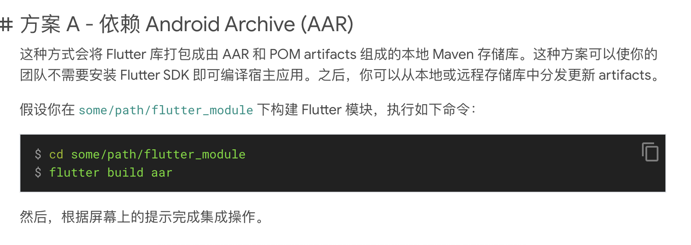

# AndroidNative


## 初次初始化项目
1. 开启科学上网，若window环境请在终端同时开启[科学代理](https://weilining.github.io/294.html)
    ```
    set http_proxy==http://127.0.0.1:7890
    ```
2. 使用as单独打开AndroidNative目录的项目，等待编译
3. 在flutter_module目录下执行命令:
   flutter create .
4. 依赖 Android Archive (AAR)[参考](https://flutter.cn/docs/add-to-app/android/project-setup#option-a---depend-on-the-android-archive-aar)

5. rebuild项目
